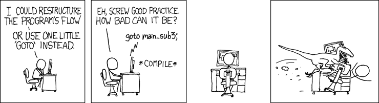

If you hang out with programmers long enough, you're bound to hear one of them vent about _technical debt_. What is _technical debt_? Why is it so bad? And more importantly, **why should you care?**

Let's begin with that classic cliché we all know and love, the dictionary definition.

> [Debt](https://www.merriam-webster.com/dictionary/debt): a state of being under obligation to pay or repay someone or something in return for something received.
> 
> [Merriam-Webster Dictionary](https://www.merriam-webster.com/dictionary/debt)

**Technical Debt** is created when we accept technical trade-offs for a short-term advantage with long-term consequences. Technical debt is a bargain we strike with our future selves. If we don't want to suffer the consequences, it must be paid back.

## I'm Not a Programmer. Why Should I Care?

_"I'm not a programmer. I'm in sales, marketing, customer service, the C-suite, or somewhere else. Why should I care about your technical debt techno-babble?"_

**Why do we write software, and who do we write it for?**

For most of us the cold, capitalist answer is _we write software to make money for our organization_. **But that's an outcome of doing the job well, not the reason we do it.** We write software because we've identified a problem we can solve for customers. We code to solve problems, delight our users, and keep them coming back. If we do that, the money happens.

**You have a stake in all of that too.** Other roles in the organization have customer and market insights critical to the software team and the product's success. If sales, marketing, and the rest of the organization are rowing in different directions, the right customers won't know we solved their problem, and software won't succeed. **We're all in this together.**

So if we're not careful, good intentions on the part of the rest of the organization to boost revenue, get a product or feature to market faster, or close a sale can create perverse incentives to take on technical debt.

**Even worse:** if a nontechnical person asks the technical team to sacrifice "doing it right" in order to "do it cheap" or "do it quick," if they get what they want and don't see a consequence, they're going to keep asking for it.

**This works, until it doesn't.**

And so, anyone that can influence software's direction can create the conditions where technical debt can flourish and lead to failure. **That's why you should care about technical debt.**

## Examples of Technical Debt

Technical debt can be created all sorts of ways. Below are a few examples of what this looks like in practice:

- **Putting sloppy code in production.** The code “works” but is poorly written. The customer may get the feature faster but the choice slows down future development because the work is hard to understand, buggy, hard to change, brittle, or inflexible.

- **Progress by Copy-and-Paste.** You deliver new features by copy-pasting old ones. In the short-term this may deliver immediate value. But you've multiplied the complexity and time required for future changes, enhancements, and bug fixes.

- **Putting inefficient code in production.** You know your code hogs resources. The customer may get your changes faster, but their experience suffer from poor performance, and the software may be significantly more expensive to host.

- **Putting code with known security vulnerabilities in production.** You know your code has potential security risks and choose to release it anyway. The customer may get the feature faster, but you've introduced code that puts all customers, and your organization's credibility, at risk.

- **Skipping Documentation.** You don't document your code in order to release it faster. In the future, developers have to stop and build an understanding of the “old code” before they can make any changes. Progress slows going forward. If you skip public-facing documentation, you may fail to build institutional and user-level knowledge of changes, missing the chance to educate and advocate for your own product.

- **Skipping Automated Testing.** The code "works"... so you think. But you skipped automated testing to release faster. You miss bugs. You introduce regressions in features that used to work before. You eventually find yourself buried in _toil_: work that is pure overhead, devoid of long-term value, because you chose to skip QA.

- **Building in Toil.** The software works but processes that could be automated are built on human intervention. This may help the product or feature release faster. But it introduces friction into the user's experience of the product and results in a product that can only scale by adding more humans. _(And those humans usually require salaries.)_

These are examples of technical debt. And to reiterate: **some debt is okay, so long as you pay it back.**

## What Are the Consequences of Technical Debt?

In the financial world, failing to pay your debts has consequences. The bank starts taking stuff, and eventually [life starts sounding like a country tune](https://www.youtube.com/watch?v=QVtfbw5JjsQ).

In software, failing to pay your debts has consequences too. It results in a high **Cost of Change.** In other words, a product with high technical debt will be harder, slower, and more expensive to build on than the same product with less technical debt. **Think of it like inflation**: the same dollar buys less new feature development today than it did yesterday.

Here are some examples of what it looks like when software is over-leveraged on technical debt.

- **Too Much Toil.** Developers are spending the majority of time engaged in _toil_: work that is pure overhead and has no long-term value to the organization. But without it, the system eventually grinds to a halt. 

- **Stagnation.** If you've spent enough time expecting “fast” solutions over “good” solutions, this eventually catches up with you. Your developers can't get to new feature development because they are buried in fixing bugs.

- **Inefficiency.** Adding a programmer to the team doesn't result in "1 programmer worth of value to the organization." You've just added an additional rower to a rowboat stuck in peanut butter, instead of water.

- **Turnover.** You can't keep talented developers because they want to solve interesting problems, not make a career of cleaning someone else's code.

- **Declaring Technical Bankruptcy**. Your software may become so cumbersome to maintain that the only sane path forward feels like starting from scratch ([which has it's own set of problems)](https://www.joelonsoftware.com/2000/04/06/things-you-should-never-do-part-i/).

## Summary

So sum it up all up: technical debt is created when trades-offs are made to accept worse code in exchange for short-term gains. This can be strategically useful, but only if you honor the promise to pay it back.

Anyone that can influence software decisions can create the conditions for technical debt. We're all in this together, and should default to promoting mature, sustainable engineering practices over shortcuts taken for short term gains.

Over-leveraging on technical debt has very real consequences that may not surface right away. If you're progress stagnates because your engineering resources are stuck fixing problems caused by a history of ignoring mature, sustainable engineering practices, you're probably over-leveraged on technical debt.

But now you know what technical debt is, and what it looks like in practice. You also know how to spot evidence that your organization has taken on too much in the past. Armed with this information, you've got the opportunity to help your organization make smarter, more sustainable decisions to reduce technical debt, and avoid creating more in the future.
